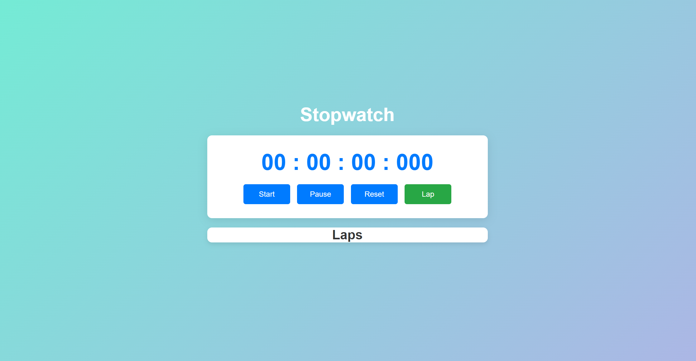
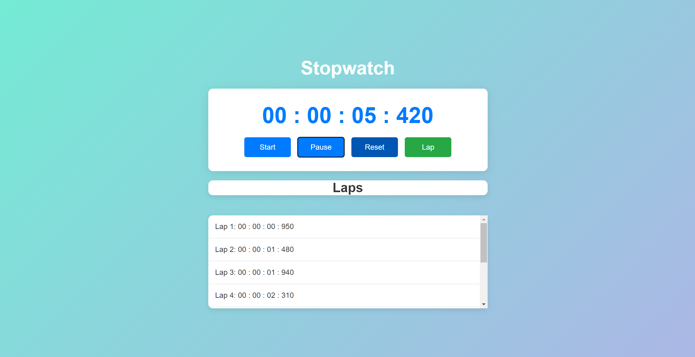

# Stopwatch Web Application

## Overview

This project is a simple web-based stopwatch application. It allows users to start, pause, reset, and record lap times. The stopwatch displays time in hours, minutes, seconds, and milliseconds.

## Features

- **Start/Stop Timer:** Begin or pause the stopwatch.
- **Reset Timer:** Reset the stopwatch to zero.
- **Record Laps:** Log lap times as you run the stopwatch.
- **Responsive Design:** Optimized for both desktop and mobile devices.

## Screenshots

### Main Interface

### Lap Times

## Technologies Used

- **HTML:** For the structure of the webpage.
- **CSS:** For styling and layout.
- **JavaScript:** For functionality and timer operations.

